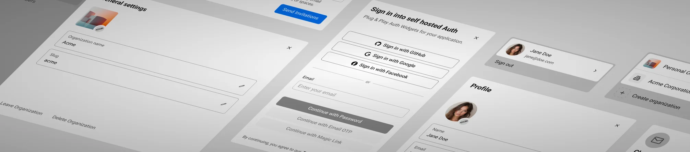

# Convex Better Auth – Svelte Adapter

Lightweight Svelte/SvelteKit adapter **wrapping** [`get-convex/better-auth`](https://github.com/get-convex/better-auth) (“Convex Better Auth”) to make it idiomatic to use in Svelte and SvelteKit.

- Documentation: [SvelteKit guide →](https://convex-better-auth.netlify.app/framework-guides/sveltekit)
- Issues & feature requests: [GitHub issues →](https://github.com/mmailaender/convex-better-auth-svelte/issues)

---

## 🚀 How do you want to start?

### 🧪 1) Custom implementation  
**When to choose this:** You have a very specific opinion about how authentication should work — maybe a custom onboarding flow, invitation logic, or multi-tenant setup that doesn’t fit typical patterns.

- You’ll wire up sign-in, sign-up, orgs, and sessions yourself.
- Perfect if you enjoy designing every flow from scratch.
- Expect days → weeks/months of work depending on polish.

📘 Start with the [SvelteKit integration guide →](https://convex-better-auth.netlify.app/framework-guides/sveltekit)

---

### ⚡ 2) Prebuilt components (shadcn-style)

**Recommended for 99 % of projects.**  
Start with fully-featured **Auth & Organization components** that you **own outright** — all source code is copied into your project.

- Polished UX and responsive layouts built for production
- 100 % editable, themeable, and extendable
- No vendor lock-in: everything runs on your Convex instance
- Saves *weeks or months* of engineering time
- Still gives you the same control as building it yourself — just faster

🧩 Get started: [Auth Components →](https://etesie.dev/docs/auth/02-getting-started/01-sveltekit)  
or explore the full source on [GitHub →](https://github.com/mmailaender/auth)

<picture>
    <source srcset="./bannerDark.webp" media="(prefers-color-scheme: dark)">
    <source srcset="./banner.webp" media="(prefers-color-scheme: light)">
    
  </picture>

---

## 🪄 Why this adapter

- ✅ **Svelte ergonomics** on top of Convex Better Auth  
- 💅 **Zero-lock-in architecture** — your data, your components  
- 💨 **Works standalone or with prebuilt UI**  
- 🧠 **Type-safe end-to-end integration via Convex**  

---

## License

MIT
